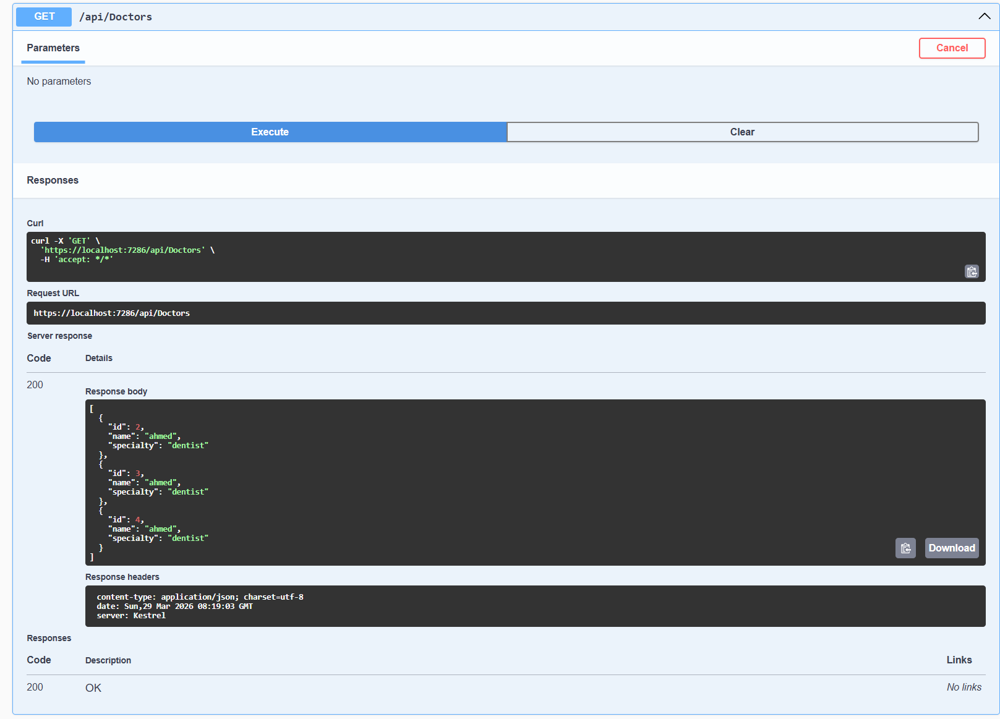
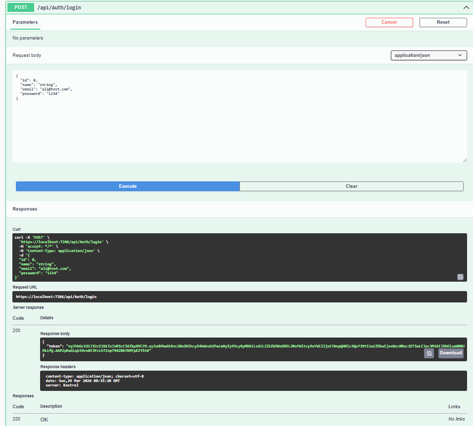
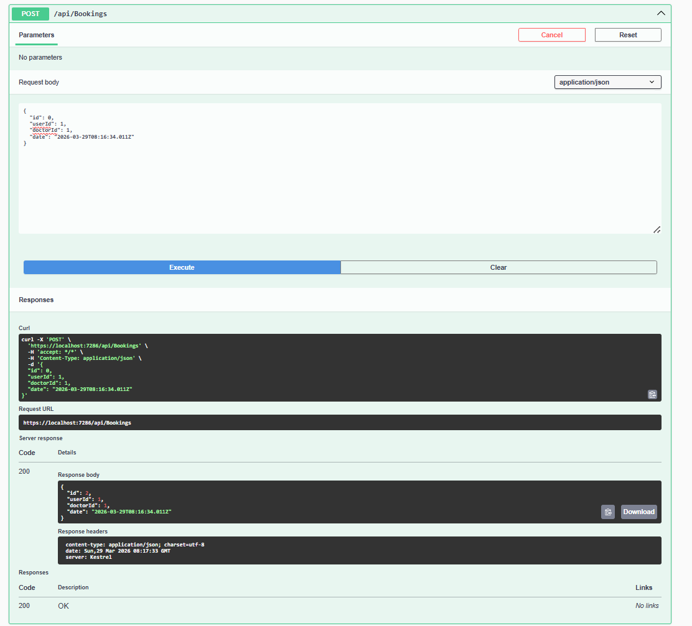
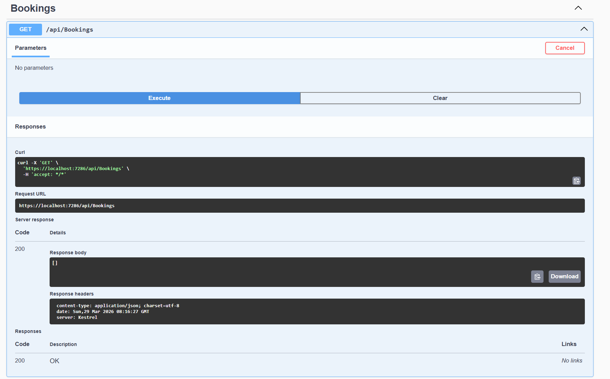
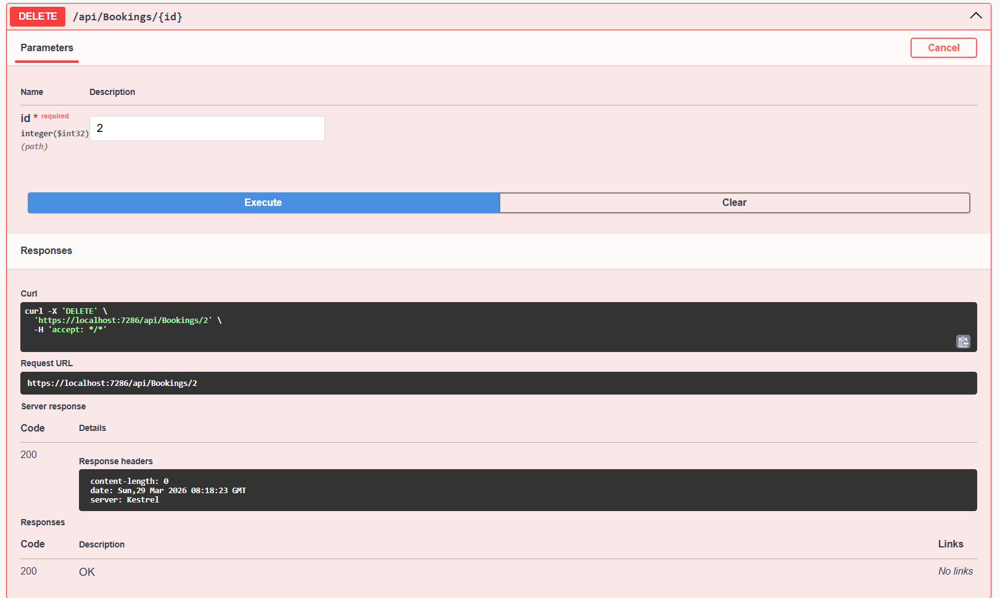

# Clinic Booking API

## 🚀 Features
- User Registration & Login (JWT Authentication)
- Doctors Management (CRUD)
- Booking System
- Clean Architecture
- SQL Server Integration

## 🛠 Technologies
- ASP.NET Core Web API
- Entity Framework Core
- SQL Server
- JWT Authentication

## 📌 Endpoints
- /api/auth/register
- /api/auth/login
- /api/doctors
- /api/bookings

## 📷 Screenshots

## 💡 Description
This project demonstrates a complete backend system for managing clinic bookings.
